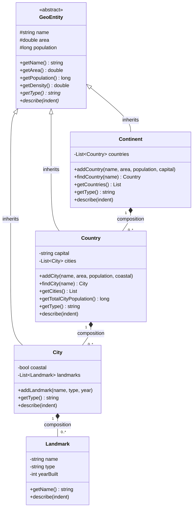

# Sistem Data Geografi: Benua – Negara – Kota

Program OOP bertema **Benua / Negara / Kota** yang dibuat dengan **C++** dan **Python**.
Konsep utama: **Composition**, **Array of Object**, dan **Hierarchical Inheritance**.

---

## 1. Janji

> Saya [NAMA LENGKAP] dengan NIM [NIM] mengerjakan Tugas Praktikum DPBO – Inheritance Lanjutan
> dalam mata kuliah Desain dan Pemrograman Berorientasi Objek untuk keberkahanNya maka saya tidak
> melakukan kecurangan seperti yang telah dispesifikasikan. Aamiin.

*(Sesuaikan teks janji dengan format yang diminta asisten/dosen.)*

---

## 2. Diagram Program



Keterangan simbol:
- Panah segitiga kosong (`<|--`): **inheritance** (is-a)
- Belah ketupat terisi (`*--`): **composition** (part-of)
- `*` pada nama method: method abstrak (pure virtual di C++, `@abstractmethod` di Python)

---

## 3. Penjelasan Atribut dan Method Setiap Kelas

### 3.1 `GeoEntity` (abstract class, parent)

Kelas induk untuk semua entitas geografis. Tidak bisa dibuat objeknya langsung.

| Atribut | Tipe | Keterangan |
|---|---|---|
| `name` | string | Nama entitas |
| `area` | double | Luas wilayah (km²) |
| `population` | long long / int | Jumlah penduduk |

| Method | Keterangan |
|---|---|
| `getName()`, `getArea()`, `getPopulation()` | Getter atribut |
| `getDensity()` | Menghitung kepadatan penduduk (`population / area`) |
| `getType()` *(abstrak)* | Mengembalikan jenis entitas ("Benua", "Negara", "Kota") |
| `describe(indent)` *(abstrak)* | Mencetak data lengkap, dengan indentasi sesuai level hierarki |
| `printHeader(indent)` / `_print_header` | Method bantu untuk mencetak baris judul (nama, luas, populasi) |

### 3.2 `Continent` (child dari `GeoEntity`)

| Atribut | Keterangan |
|---|---|
| `countries` | Array/vector/list berisi objek `Country` |

| Method | Keterangan |
|---|---|
| `addCountry(...)` | Membuat objek `Country` **di dalam** `Continent` lalu menyimpannya ke array |
| `findCountry(name)` | Mencari negara berdasarkan nama |
| `getCountries()` | Mengembalikan daftar negara |
| `getType()` | Override: mengembalikan "Benua" |
| `describe(indent)` | Override: mencetak data benua lalu seluruh negara di dalamnya |

### 3.3 `Country` (child dari `GeoEntity`)

| Atribut | Keterangan |
|---|---|
| `capital` | Nama ibu kota |
| `cities` | Array/vector/list berisi objek `City` |

| Method | Keterangan |
|---|---|
| `addCity(...)` | Membuat objek `City` **di dalam** `Country` lalu menyimpannya ke array |
| `findCity(name)` | Mencari kota berdasarkan nama |
| `getCities()` | Mengembalikan daftar kota |
| `getTotalCityPopulation()` | Menjumlahkan populasi seluruh kota yang terdata |
| `getType()` | Override: mengembalikan "Negara" |
| `describe(indent)` | Override: mencetak data negara lalu seluruh kotanya |

### 3.4 `City` (child dari `GeoEntity`)

| Atribut | Keterangan |
|---|---|
| `coastal` | `true` jika kota berada di pesisir |
| `landmarks` | Array/vector/list berisi objek `Landmark` |

| Method | Keterangan |
|---|---|
| `addLandmark(name, type, year)` | Membuat objek `Landmark` **di dalam** `City` |
| `getType()` | Override: mengembalikan "Kota" |
| `describe(indent)` | Override: mencetak data kota, status pesisir, dan daftar landmark |

### 3.5 `Landmark` (kelas mandiri, tidak mewarisi apa pun)

| Atribut | Keterangan |
|---|---|
| `name` | Nama landmark |
| `type` | Jenis (monumen, kuil, menara, dll.) |
| `yearBuilt` | Tahun dibangun |

| Method | Keterangan |
|---|---|
| `getName()` | Getter nama |
| `describe(indent)` | Mencetak satu baris data landmark |

---

## 4. Penjelasan Desain Program

### 4.1 Inheritance yang dipakai: Hierarchical Inheritance

Satu parent `GeoEntity` diwarisi oleh **tiga child** sekaligus: `Continent`, `Country`, dan `City`.
Ini cocok disebut *hierarchical inheritance* karena beberapa subclass mewarisi dari satu superclass yang sama.

Alasan rasional memakai inheritance di sini:
- Benua, negara, dan kota **adalah** entitas geografis (hubungan *is-a*) dan sama-sama punya nama, luas, dan populasi.
- Atribut dan method yang sama (`name`, `area`, `population`, `getDensity()`) cukup ditulis sekali di parent, sehingga tidak ada kode berulang.
- Setiap child memberi implementasi sendiri untuk `getType()` dan `describe()` (**polimorfisme**). Pada bagian ringkasan di `main`, semua objek dimasukkan ke satu array bertipe `GeoEntity` dan dipanggil dengan cara yang sama.

`GeoEntity` dibuat **abstract** agar tidak ada objek "entitas geografis" yang tidak jelas jenisnya.

### 4.2 Composition yang dipakai

Hubungan *has-a* / *part-of* berlapis tiga tingkat:

| Pemilik (whole) | Bagian (part) | Alasan memakai composition |
|---|---|---|
| `Continent` | `Country` | Negara adalah bagian dari benua |
| `Country` | `City` | Kota adalah bagian dari negara |
| `City` | `Landmark` | Landmark adalah bagian dari kota |

Ciri composition pada program ini:
- Objek bagian **dibuat di dalam method pemilik** (`addCountry`, `addCity`, `addLandmark`), bukan dibuat di luar lalu dimasukkan.
- Di C++, bagian disimpan **by value** di dalam `vector`, jadi ikut hilang ketika pemilik dihancurkan.
- Di Python, bagian dibuat di dalam pemilik dan tidak dibagikan ke objek lain, sehingga umur objek bagian mengikuti pemiliknya.

Mengapa tidak memakai inheritance di sini? Kota *bukan* sebuah negara, melainkan *bagian dari* negara. Jadi hubungan yang tepat adalah *has-a* (composition), bukan *is-a*.

### 4.3 Array of Object

Tiga array dipakai: `vector<Country>` di `Continent`, `vector<City>` di `Country`, dan `vector<Landmark>` di `City` (di Python berupa `list`). Selain itu, di `main` ada array `vector<const GeoEntity*>` (C++) / `list` (Python) yang berisi campuran benua, negara, dan kota untuk menunjukkan polimorfisme.

### 4.4 Data awal dan data tambahan

| | Data awal (sebelum) | Data ditambahkan (sesudah) |
|---|---|---|
| Negara | Indonesia, Jepang | Thailand |
| Kota | Jakarta, Bandung, Surabaya, Tokyo, Osaka | Yogyakarta, Kyoto, Bangkok |
| Landmark | Monas, Gedung Sate, Tokyo Tower, Kastil Osaka | Gedung Merdeka (di Bandung), Malioboro, Kinkaku-ji, Wat Arun |

Data bersifat statis (ditulis langsung di `main`). Angka luas dan populasi adalah perkiraan untuk keperluan latihan.

---

## 5. Alur Program (berlaku untuk C++ dan Python)

1. **Buat objek `Continent`** bernama Asia.
2. **Tambah data awal**:
   1. Panggil `addCountry` untuk Indonesia dan Jepang.
   2. Cari tiap negara dengan `findCountry`, lalu `addCity` untuk kota-kotanya.
   3. Cari tiap kota dengan `findCity`, lalu `addLandmark`.
3. **Cetak data sebelum penambahan** dengan `asia.describe()`. Method ini memanggil `describe()` negara, yang memanggil `describe()` tiap kota, yang memanggil `describe()` tiap landmark (cetak berjenjang dengan indentasi).
4. **Tambah data baru**: negara Thailand, kota Yogyakarta, Kyoto, Bangkok, dan beberapa landmark baru.
5. **Cetak data sesudah penambahan** dengan `asia.describe()` lagi.
6. **Cetak ringkasan polimorfisme**:
   1. Kumpulkan benua, semua negara, dan semua kota ke satu array bertipe `GeoEntity`.
   2. Lewati array itu, panggil `getType()`, `getName()`, `getPopulation()`, `getDensity()` pada tiap elemen, lalu cetak sebagai tabel.
7. Program selesai.

Catatan C++: pointer hasil `findCountry` / `findCity` dicari ulang setelah menambah elemen, karena `vector` bisa memindahkan isinya di memori ketika ukurannya bertambah.

---

## 6. Cara Menjalankan

**C++**
```bash
cd CPP/Program
g++ -std=c++17 -o geo main.cpp
./geo            # Windows: geo.exe
```

**Python**
```bash
cd Python/Program
python main.py
```

---

## 7. Dokumentasi

Teks hasil eksekusi kedua program identik. Berkas teks lengkap ada di
`CPP/Dokumentasi/output_cpp.txt` dan `Python/Dokumentasi/output_python.txt`.

### C++


### Python


*(Ganti dengan screenshot/screenrecord hasil jalan di komputermu sendiri dan simpan dengan nama file di atas.)*

Cuplikan output (bagian awal):

```text
==================================================
        DATA SEBELUM PENAMBAHAN
==================================================
[Benua] Asia | Luas: 44579000.0 km2 | Populasi: 4700000000
  Jumlah negara terdata: 2
    [Negara] Indonesia | Luas: 1904569.0 km2 | Populasi: 278000000
      Ibu kota: Jakarta | Jumlah kota terdata: 3 | Total pop. kota terdata: 16000000
        [Kota] Jakarta | Luas: 662.0 km2 | Populasi: 10600000
          Kota pesisir: Ya | Landmark: 1
            - Monas (Monumen, 1975)
        ...
```

---

## 8. Struktur Folder

```text
Project/
├── README.md
├── CPP/
│   ├── Program/        main.cpp
│   └── Dokumentasi/    output_cpp.txt, screenshot_cpp.png
└── Python/
    ├── Program/        main.py
    └── Dokumentasi/    output_python.txt, screenshot_python.png
```
